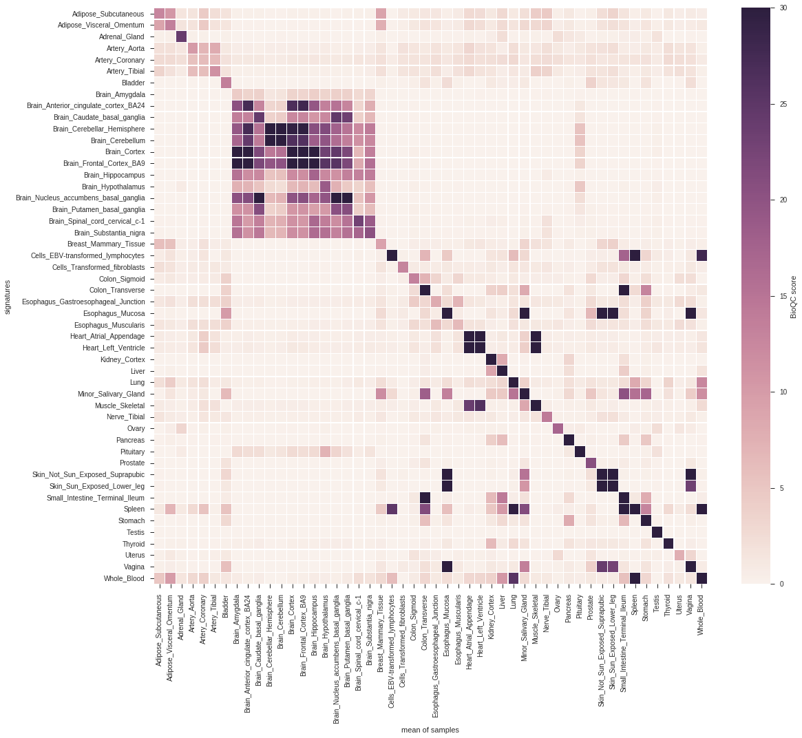
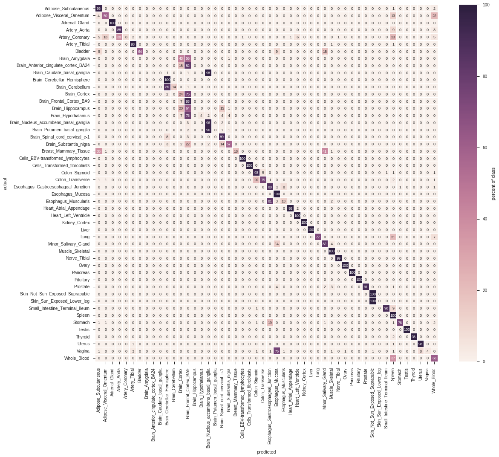

# Creating signatures
*pygenesig* shippes with multiple classes for signature generation. Here, we use the 
[GiniSignatureGenerator](apidoc.html#module-pygenesig.gini).
All methods are described in the [API documentation](apidoc.html). 

First, we load the expression data and target annotation we [prepared earlier](prepare_data.html):
```python
from pygenesig.file_formats import read_expr, read_target 
expr = read_expr("expression_matrix.npy")
target = read_target("target.txt")
```

Now, we can generate signatures with the signature generator of our choice:
```python
from pygenesig.gini import GiniSignatureGenerator
sg = GiniSignatureGenerator(expr, target)
signatures = sg.mk_signatures()
```

Which will result in something like
```
{'Adipose Tissue': {81,
  82,
  250,
  304,
  309,
  ...}
```

# Testing signatures
*pygenesig* shippes with the `BioQCSignatureTester`. The method is described in more 
detail [here](apidoc.html#signature-testers).

To test signatures, we initalize the tester with the gene expression data and the 
target labels. Then, we can test different signature sets on the data and retrieve a
score matrix. 

```python
from pygenesig.bioqc import BioQCSignatureTester
st = BioQCSignatureTester(expr, target)
score_matrix = st.score_signatures(signatures)
```

This is a score matrix visualized as a heatmap: 
```python
from pygenesig.visualization import aggregate_scores, plot_score_heatmap
sig_labels = st.sort_signatures(signatures)
heatmap = aggregate_scores(sig_labels, score_matrix, target)
plot_score_heatmap(heatmap)
```


```eval_rst
.. Note::
    As python dictionaries have no particular order you can use ``SignatureTester.sort_signatures()`` to obtain a reproducable order of the signatures. 
```

We can boil down signature testing to a classification task: A sample is 
classified as a certain tissue, if the corresponding signature scores highest. 
*pygenesig* provides a convenient method to predict class labels:

```python
actual, predicted = st.classify(signatures, score_matrix)
```

From the list of actual and predicted labels, we can create a confusion matrix.
*Pygenesig* provides convenient wrapper method to create the confusion matrix,
but essentially you can use whatever performance measure from
[scikit-learn](http://scikit-learn.org/stable/modules/classes.html#sklearn-metrics-metrics). 

```python
confusion_matrix = st.confusion_matrix(signatures, actual, predicted)
```

This is the confusion matrix derived from the above score matrix: 
```python
from pygenesig.visualization import plot_confusion_matrix_heatmap
plot_confusion_matrix_heatmap(confusion_matrix * 100, sig_labels)
```



# Putting it together: crossvalidation 
To avoid overfitting sample-specific noise, we can use *crossvalidation* to create and test signatures.
To this end, we divide our data into 10 independent, *stratified* folds 
(*i.e.* every fold contains about the same amount of items from every class). 
We always use 9 of the 10 folds for generating the signatures and apply them to 
the remaining fold for testing. This procedure is illustrated in the following flowchart:

<!-- edit flowchart on https://www.draw.io/?chrome=0&lightbox=1&edit=https%3A%2F%2Fwww.draw.io%2F%23G0BxECzhdeMGwJQXB5ZjNHckRWRzQ&nav=1#G0BxECzhdeMGwJQXB5ZjNHckRWRzQ --> 


You can use scikit-learn [StratifiedKFold](http://scikit-learn.org/stable/modules/generated/sklearn.model_selection.StratifiedKFold.html#sklearn.model_selection.StratifiedKFold)
to split your data into folds and then apply a `SignatureGenerator` and a `SignatureTester`
on the resulting testing and training sets. 

In *pygenesig* this is already implemented in `cv_score` ([documentation](apidoc.html#pygenesig.validation.cv_score). 
The method automatically performs the cross validation, given a gene expression matrix and target annotation: 

```python
from pygenesig.validation import cv_score
from pygenesig.gini import GiniSignatureGenerator
from pygenesig.bioqc import BioQCSignatureTester

expr_file = "exprs.npy"
target_file = "target.csv"

sig_list, res_list, train_list, test_list = cv_score(expr_file,
                                                     target_file,
                                                     GiniSignatureGenerator,
                                                     BioQCSignatureTester)
```

The cross-validation function uses [dask](http://dask.pydata.org) for multiprocessing.
Dask is a scalable, highly customizable framework for running python code in parallel. 
It supports different *schedulers* for code execution. We recommend using the 
[distributed](https://distributed.readthedocs.io/en/latest/quickstart.html) scheduler.
It allows you to run analyses in parallel on a high performance cluster, but also provides a convenient way
to parallelize on a single machine. 

The objects returned by `cv_score` are so-called *dask-graphs*, i.e. instructions for `dask` how to 
obtain a result, which can be sent to a scheduer for actual computation. This is what we do in the next 
step using the `distributed` scheduler. 

```python
from dask import compute
from dask.distributed import Client, LocalCluster

cluster = LocalCluster(n_workers=10, threads_per_worker=1)
client = Client(cluster)

signatures, scores, train_inds, test_inds = compute(sig_list, res_list, train_list, test_list,
                                            get=client.get)
```

Now we obtained a list of signatures, score matrices and the indicies of the samples used for training
and testing in each fold. We can derive an average score matrix or an average confusion matrix from these
results.

In order to assess the quality of a signature it is also interesting to see, how much a signature varies
between the different folds. To this end, we calculate the pairwise jaccard index of the signatures
between all folds:

```python
import seaborn as sns
from pygenesig.tools import pairwise_jaccard_ind
from pylab import *
import pandas as pd

pairwise_jaccard = pairwise_jaccard_ind(signatures)
fig, ax = subplots(figsize=(15,5))
data=pd.DataFrame(pairwise_jaccard)
sns.boxplot(data=data, ax=ax)
ax.set_title("Pairwise Jaccard Index")
ax.set_xticklabels(data.columns, rotation=90);
```


# Case studies
We have successfully applied *pygenesig* and [*pygenesig-pipeline*](https://github.com/grst/pygenesig-pipeline)
to evaluate methods for signature generation and to compare the performance of signatures on different datasets. 
Here are some of the results as *jupyter notebooks* which also serve well as an example on how to apply *pygenesig*.

* [Cross validation](https://github.com/grst/pygenesig-example/blob/80bfe2a388a5230b004c288cb2ea220f0394855d/old_notebooks/validate_gini.ipynb): 
Full working example of cross-validation on GTEx data. 
* [Grid search for parameter optimization](https://github.com/grst/pygenesig-example/blob/80bfe2a388a5230b004c288cb2ea220f0394855d/old_notebooks/gini-gridsearch.ipynb): Systematic test of different parameters for the [GiniSignatureGenerator](apidoc.html#module-pygenesig.gini). 
We found, that gini-index is a robust method for signature generation over a wide range of parameters. 
* [Cross-platform and cross-species validation](https://github.com/grst/pygenesig-example/blob/80bfe2a388a5230b004c288cb2ea220f0394855d/notebooks/gtex_vs_mouse_gnf.ipynb): 
Validation of signatures on a different platform and organism. We generated gene signatures on the GTEx dataset 
(human, next generation sequenceing) and applied them to a mouse dataset (Affymetrix microarray). 
For most of the tissues, the signatures are still able to identify their respective tissue.  
* [GTEx vs. FANTOM5](https://github.com/grst/pygenesig-example/blob/80bfe2a388a5230b004c288cb2ea220f0394855d/notebooks/gtex_vs_fantom5.ipynb): Validate signatures generated on the GTEx dataset on data from FANTOM5. 

More examples are available from the [*pygenesig-example*](https://github.com/grst/pygenesig-example) repository. 

