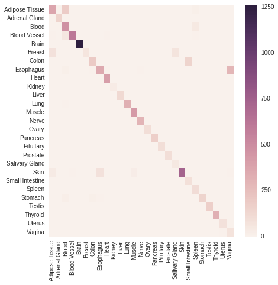
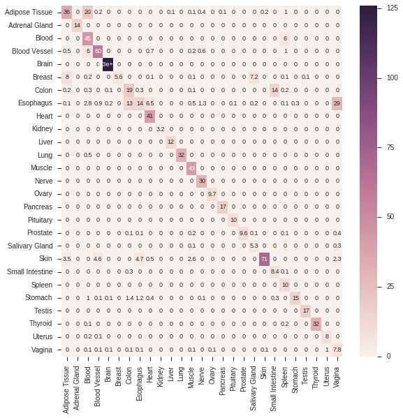

# Creating signatures
*pygenesig* shippes with multiple classes for signature generation. Here, we use the 
[GiniSignatureGenerator](apidoc.html#module-pygenesig.gini).
All methods are described in the [API documentation](apidoc.html). 

First, we load the expression data and target annotation we [prepared earlier](prepare_data.html):
```python
from pygenesig.file_formats import read_expr, read_target 
expr = read_expr("expression_matrix.npy")
target = read_target("target.txt")
```

Now, we can generate signatures with the signature generator of our choice:
```python
from pygenesig.gini import GiniSignatureGenerator
sg = GiniSignatureGenerator(expr, target)
signatures = sg.mk_signatures()
```

Which will result in something like
```
{'Adipose Tissue': {81,
  82,
  250,
  304,
  309,
  ...}
```

# Testing signatures
*pygenesig* shippes with the `BioQCSignatureTester`. The method is described in more 
detail [here](apidoc.html#signature-testers).

To test signatures, we initalize the tester with the gene expression data and the target labels. 
Then, we can test different signature sets on the data:

```python
from pygenesig.bioqc import BioQCSignatureTester
st = BioQCSignatureTester(expr, target)
score_matrix = st.score_signatures(signatures)
```

From the list of actual and predicted labels, we can for example create a confusion matrix. *Pygenesig* provides
a convenient wrapper method to create the confusion matrix, but essentially you can use whatever performance measure from [scikit-learn](http://scikit-learn.org/stable/modules/classes.html#sklearn-metrics-metrics). 

```python
actual, predicted = st.classify(signatures, score_matrix)
confusion_matrix = st.confusion_matrix(signatures, actual, predicted)
```

```python
import seaborn as sns
confmat = st.confusion_matrix(signatures, actual, predicted)
sig_labels = st.sort_signatures(signatures)
sns.heatmap(confmat, xticklabels=sig_labels, yticklabels=sig_labels
```



```eval_rst
.. Note::
    As python dictionaries have no particular order you can use ``SignatureTester.sort_signatures()`` to obtain a reproducable order of the signatures. 
```

# Putting it together: crossvalidation 
To avoid overfitting sample-specific noise, we can use *crossvalidation* to create and test signatures.
To this end, we divide our data into 10 independent, *stratified* folds 
(*i.e.* every fold contains about the same amount of items from every class). 
We always use 9 of the 10 folds for generating the signatures and apply them to 
the remaining fold for testing. This procedure is illustrated in the following flowchart:

<!-- edit flowchart on https://www.draw.io/?chrome=0&lightbox=1&edit=https%3A%2F%2Fwww.draw.io%2F%23G0BxECzhdeMGwJQXB5ZjNHckRWRzQ&nav=1#G0BxECzhdeMGwJQXB5ZjNHckRWRzQ --> 


You can use using scikit-learn [StratifiedKFold](http://scikit-learn.org/stable/modules/generated/sklearn.model_selection.StratifiedKFold.html#sklearn.model_selection.StratifiedKFold) to split your data into folds and then apply a `SignatureGenerator` and a `SignatureTester` on the resulting testing and training sets. 

In *pygenesig* this is already implemented in `cross_validate_signatures` ([documentation](apidoc.html#pygenesig.validation.cross_validate_signatures)). The method automatically performs the cross validation, given a gene expression matrix and target annotation: 

```python
from pygenesig.validation import cross_validate_signatures
from pygenesig.gini import GiniSignatureGenerator
from pygenesig.bioqc import BioQCSignatureTester

expr_file = "exprs.npy"
target_file = "target.csv"

signature_graphs, result_graphs = cross_validate_signatures(expr_file,
                                                        target_file,
                                                        GiniSignatureGenerator,
                                                        BioQCSignatureTester)
```

The cross-validation function uses [dask](http://dask.pydata.org) for multiprocessing. It returns 
a list of [dask graphs](http://dask.pydata.org/en/latest/custom-graphs.html) to compute the signatures and
confusion matrices.  

Dask supports a [bunch of schedulers](http://dask.pydata.org/en/latest/scheduler-overview.html). The [distributed](https://distributed.readthedocs.io/en/latest/quickstart.html) scheduler, for instance, allows you to run the cross-validation on a high performance cluster. To keep it simple, we use the `multiprocessing` scheduler here to compute the dask-graphs. Note, that for large gene expression matrices, this can be memory-intensive! 
```python
import dask.multiprocessing
from dask.base import compute

signatures, confusion_matrices = compute([signature_graphs, result_graphs],
                                            get=dask.multiprocessing.get,
                                            num_workers=5)
```

Now, we can easily compute and display the average confusion matrix of the 10 folds: 
```python
import numpy as np
import seaborn as sns

conf_mat_mean = np.mean(np.array(confusion_matrices), axis=0)
sig_labels = BioQCSignatureTester.sort_signatures(signatures[0])
fig, ax = subplots(figsize=(9, 9))
sns.heatmap(conf_mat_mean, ax=ax, 
            xticklabels=sig_labels, yticklabels=sig_labels,
            annot=True,annot_kws={"size": 9})
```


# Case studies
We have performed several case studies using *pygenesig* on the [GTEx](http://www.gtexportal.org/home/) dataset.
These studies can be understood as 'extended examples' of how to use *pygenesig* and are available
on [github](https://github.com/grst/gene-set-study/tree/master/notebooks). 

* [Cross validation](https://github.com/grst/gene-set-study/blob/master/notebooks/validate_gini.ipynb): Full working example of cross-validation on GTEx data. 
* [Grid search for parameter optimization](https://github.com/grst/gene-set-study/blob/master/notebooks/gini-gridsearch.ipynb): Systematic test of different parameters for the [GiniSignatureGenerator](apidoc.html#module-pygenesig.gini). We found, that gini-index is a robust method for signature generation over a wide range of parameters. 
* [Cross-platform and cross-species validation](https://github.com/grst/gene-set-study/blob/master/notebooks/validate-mouse.ipynb): Validation of signatures on a different platform and organism. We generated gene signatures on the GTEx dataset (human, next generation sequenceing) and applied them to a mouse dataset (Affymetrix microarray). For most of the tissues, the signatures are still able to identify their respective tissue.  

